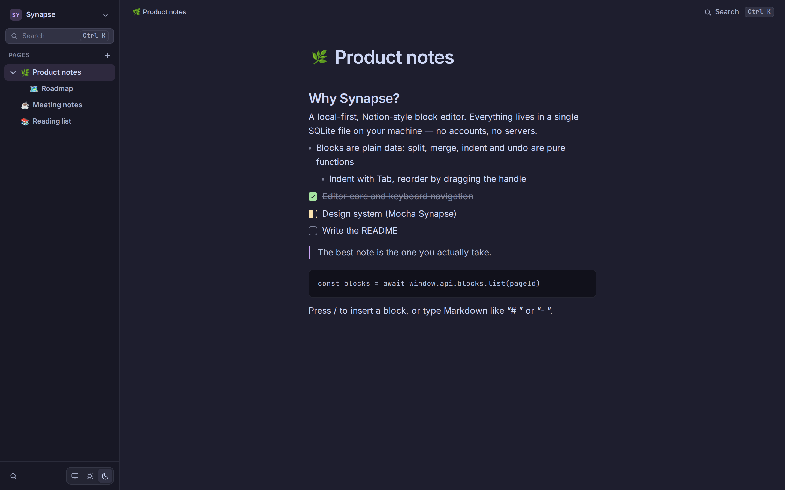
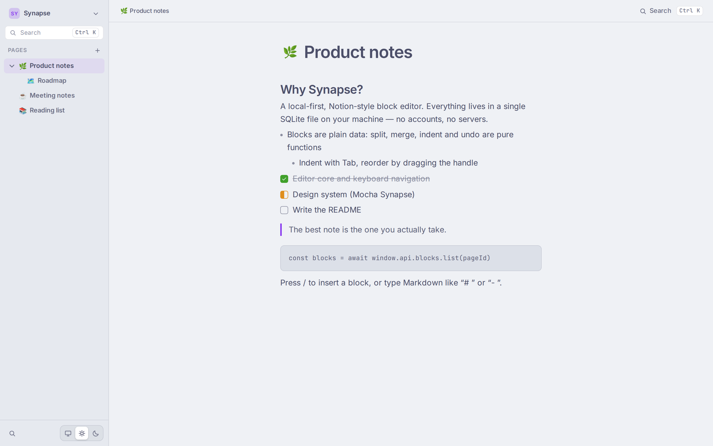
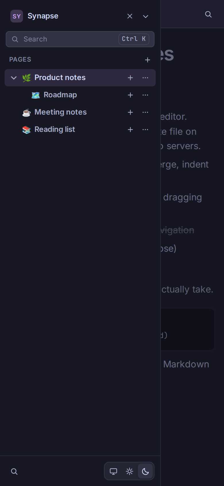

# Synapse

A local-first, Notion-style block editor built with Electron, React and SQLite.

[](https://github.com/ToguDV/synapse/actions/workflows/ci.yml)
[](LICENSE)



Synapse is an offline-first note-taking desktop app: pages and blocks live in a
local SQLite database, the renderer never touches Node APIs, and every feature
was built to keep the door open for a mobile shell later.

## Features

- **Block editor** with one `contenteditable` per block: paragraph, heading,
  bullet, todo, code, quote and divider, extensible through a single block
  registry.
- **Notion-style interactions**: `/` slash menu, Markdown input rules
  (`# `, `- `, `[] `, `> `, ` ``` `, `---`), block handle with convert /
  duplicate / move / delete, drag & drop with reindent.
- **Selections**: multi-block selection (Shift+click, Shift+arrows, Ctrl+D) and
  cross-block text selection (mouse drag, Shift+click, Shift+arrows, Ctrl+A)
  with transactional replace / cut / paste / delete.
- **Pages**: nested tree in the sidebar, breadcrumbs, emoji icons, drag & drop
  reordering, autosave and delete confirmation. The sidebar is virtualized and
  stays responsive with tens of thousands of pages.
- **Todos with five states**: backlog, todo, in progress, done, cancelled.
- **Global search** (`Ctrl/⌘+K`) over page titles and block content with
  snippets and jump-to-block.
- **Themes**: light, dark and system, built on the Catppuccin Latte / Mocha
  "Mocha Synapse" design system.
- **Responsive and touch ready**: mobile drawer, bottom sheets, long-press and
  swipe gestures for narrow screens.
- **Undo / redo**, debounced autosave over a batched IPC contract, and typed
  i18n catalogs ready for more languages.

## Screenshots

| Light | Mobile |
| --- | --- |
|  |  |

## Tech stack

| Layer | Choice |
| --- | --- |
| Shell | Electron + electron-vite + electron-builder |
| UI | React 18 + TypeScript strict + Tailwind CSS |
| State | Zustand |
| Data | Local SQLite (better-sqlite3 in the main process) |
| Editor | Own per-block architecture (each block is a React component) |
| i18n | Own typed catalogs (`t`/`tList`, `Intl.PluralRules`), no dependencies |
| Tests | Vitest (unit) + Playwright (E2E renderer with a mocked `api`) |

## Architecture

- **Main (Node)**: window, SQLite schema and repositories, typed IPC handlers,
  search, `nativeTheme`.
- **Preload**: `contextBridge` exposing a typed `Api` (`contextIsolation: true`,
  `nodeIntegration: false`, sandbox).
- **Renderer (React)**: the app and the editor. It never imports `electron` or
  `node:*` modules; all data access goes through `window.api`.
- **Shared**: types, content serialization, domain rules (page ordering and
  moves) and small utilities used by every process.

The editor core keeps transformations pure and testable (`split`, `merge`,
`indent`, `outdent`, `move`, `changeType`, `duplicate`, `removeBlocks`,
`insertAfter`) with stable identity, and a focus manager that maps the caret
across block boundaries.

Data lives in a single SQLite file (`~/.config/synapse/synapse.db` on Linux)
with `pages`, `blocks` and `settings` tables. Blocks are stored as a flat list
with `indent`, exactly like Notion's real model.

## Development

Everything runs inside Docker; the host only needs Docker + Compose and X11 on
Linux.

```bash
./docker/x11-allow.sh                    # once per graphical session (container X11)
docker compose run --rm dev npm install  # dependencies live in a Docker volume
docker compose up dev                    # HMR dev window on your desktop
```

Other useful commands:

```bash
docker compose run --rm dev npm run typecheck   # tsc strict (node + web)
docker compose run --rm dev npm test            # Vitest unit suite
docker compose run --rm builder npm run dist:linux
docker compose down                             # stop (volumes persist)
```

`npm run dist:linux` produces an AppImage and a `.deb` under `release/`.

## Tests

- **Unit** (Vitest): transformations, stores, repositories, i18n, search and
  mock fidelity — `docker compose run --rm dev npm test`.
- **E2E** (Playwright against the renderer with a mocked `api`, no Electron):
  serve the renderer and run the runners from the host.

```bash
docker compose run -d --rm --name synapse-e2e dev npx vite --config tests/vite.e2e.config.ts

node e2e/phase3.e2e.cjs && node e2e/phase4.e2e.cjs && node e2e/phase5.e2e.cjs && node e2e/phase6.e2e.cjs
node e2e/theme.e2e.cjs && node e2e/anchor-tracking.e2e.cjs && node e2e/page-dnd.e2e.cjs
node e2e/mobile.e2e.cjs && node e2e/sidebar-virtualization.e2e.cjs
node e2e/adv-phase4.e2e.cjs && node e2e/adv-selection.e2e.cjs

docker stop synapse-e2e
```

The runners resolve Playwright from the project dependency, the
`SYNAPSE_PLAYWRIGHT` environment variable or the npm npx cache (in that order):

```bash
npx playwright install chromium   # one-time browser download
node e2e/phase3.e2e.cjs           # or: SYNAPSE_PLAYWRIGHT=/path/to/playwright node e2e/phase3.e2e.cjs
```

## Project layout

```
synapse/
├─ src/
│  ├─ shared/          # Page/Block/api types and domain rules
│  ├─ main/            # window, db/ (connection, schema, repositories), ipc/
│  ├─ preload/         # typed contextBridge API
│  └─ renderer/src/
│     ├─ editor/       # store, registry, transforms, caret, persistence
│     ├─ blocks/       # one component per block type
│     ├─ i18n/         # typed catalogs, t()/tList()
│     ├─ store/        # zustand stores (pages, theme)
│     └─ ui/           # sidebar, menus, search, dialogs
├─ e2e/                # Playwright runners + api mock
├─ tests/              # Vitest suites
├─ benchmarks/         # page-scale stress benchmark
├─ design/             # static design-system preview
├─ DESIGN.md           # Mocha Synapse design system
└─ AGENTS.md           # development log and project plan (Spanish)
```

## Status and roadmap

The MVP is complete: persistence, editor core, Notion-style blocks and UX,
nested pages, search, themes, typed i18n, design system, packaging and the
responsive/touch layer all ship today. Next up:

- Inline rich text (marks within a block), tables, charts, Markdown export and
  sync.
- Mobile polish: touch multi-selection, indent/outdent without a keyboard,
  swipe-to-close sheets and a language selector.

See `AGENTS.md` for the full phase-by-phase log and `DESIGN.md` for the design
system.

## Credits

Bundled fonts: [Inter](https://github.com/rsms/inter),
[JetBrains Mono](https://github.com/JetBrains/JetBrainsMono) and
[Noto Color Emoji](https://github.com/googlefonts/noto-emoji), all under the
SIL Open Font License 1.1. See
[THIRD_PARTY_NOTICES.md](THIRD_PARTY_NOTICES.md).

## License

[MIT](LICENSE) © 2026 ToguDV
